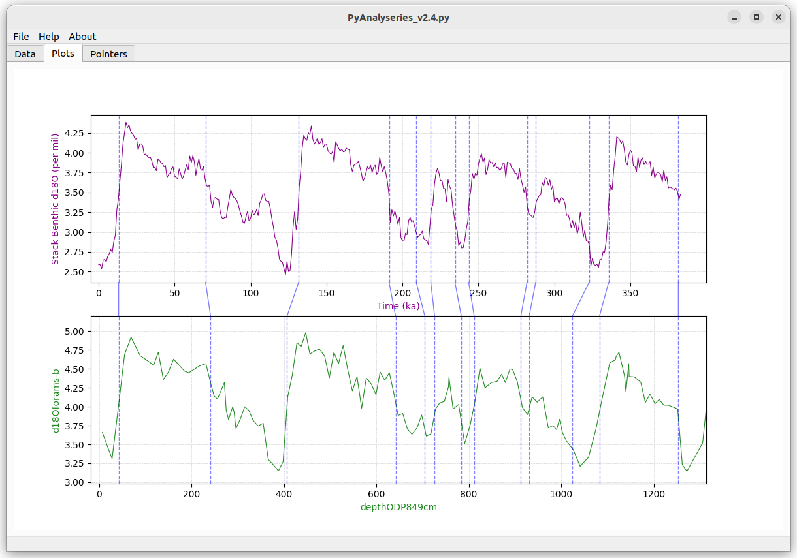
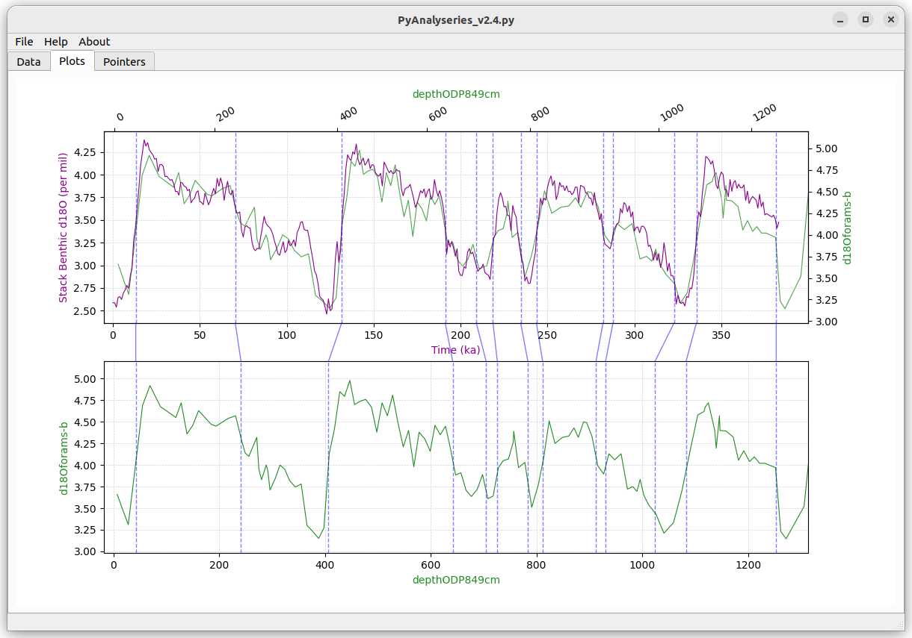
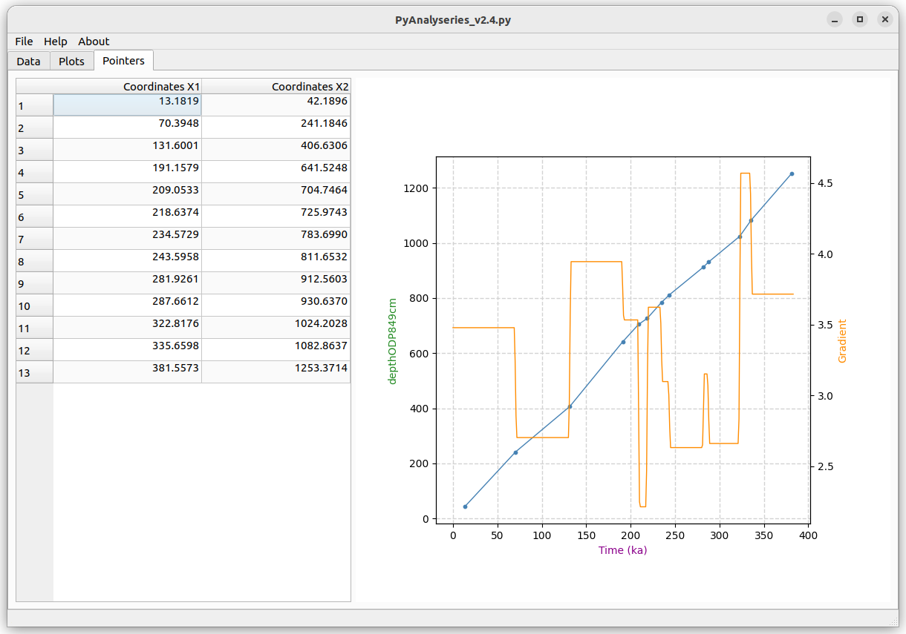

## PyAnalySeries

Python version for Analyseries

Select interactively match points on 2 curves to visualize the resulting interpolated curve. 

Based on:
 * numpy
 * pandas
 * matplotlib
 * scipy
 * openpyxl
 * PyQt

#### Installation

##### Get the application
 * `git clone https://github.com/PBrockmann/PyAnalySeries`
 * `cd PyAnalySeries`

##### Create a python environment to use PyAnalySeries 

 * `conda create --name env_PyAnalySeries`
 * `conda env list`
 * `conda activate env_PyAnalySeries`
 * `conda install python`
 * `pip install -r requirements.txt`

##### Test
 * `python PyAnalySeries_v2.4.py`
 * `python PyAnalySeries_v2.4.py testFile.xlsx`

#### Captures

  

  

  
