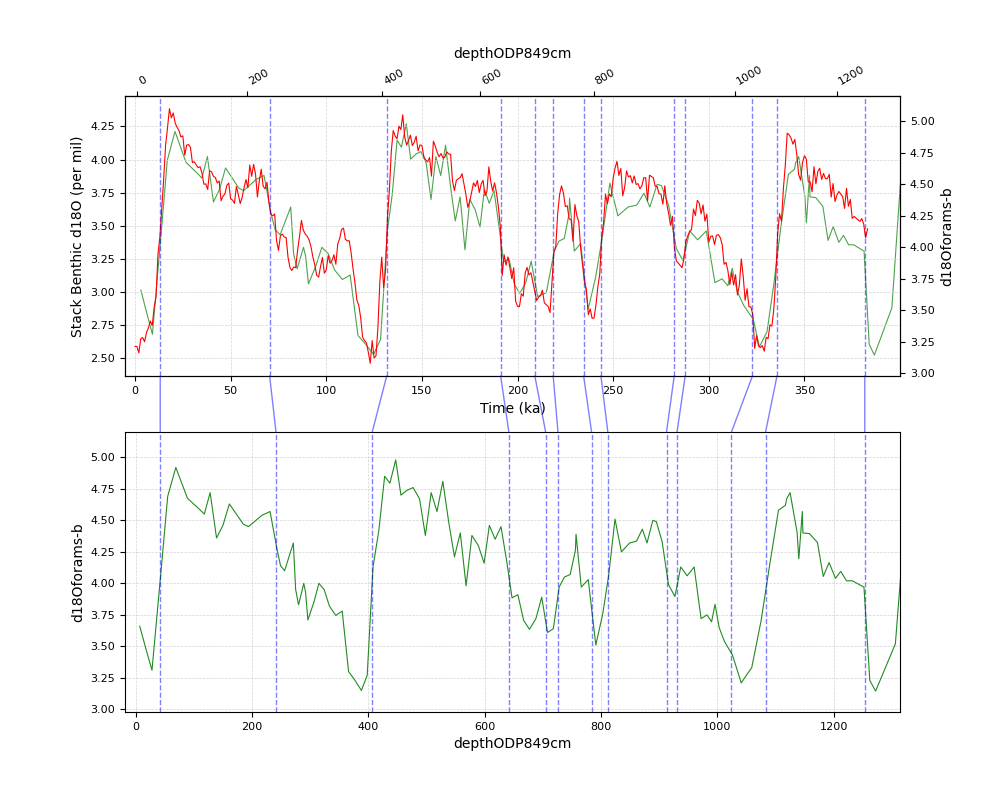

# PyAnalyseries

Python version for Analyseries

Select interactively match points on 2 curves to visualize the resulting interpolated curve. 

Based on:
 * matplotlib
 * scipy
 * openpyxl

## Captures

  

  

## Usage

```
####################################################################################################################
Usage:  lineage.py [-h]
        [-p filePointers]
        [-k kindInterpolation]
        fileCSV x1Name y1Name x2Name y2Name

Options:
        -h, -?, --help, -help
                Print this manual
        -p, --pointers
                Pointers file (csv format, 2 columns, no header)
        -k, --kind
                Interpolation kind 'linear' or 'quadratic' (default 'linear')

Examples:
        lineage.py -p pointers2.csv testFile.csv 'Time (ka)' 'Stack Benthic d18O (per mil)' 'depthODP849cm' 'd18Oforams-b'
```

## Interactions 

```
-------------------------------------------------------------------------------
Press 'h'
    Display this help 
-------------------------------------------------------------------------------
Hold shift key while right click on a curve
    Create or move a pointer
-------------------------------------------------------------------------------
Hold down ctrl key on a plot
    Display points of the curve
-------------------------------------------------------------------------------
Hold down ctrl key on a plot while right click on a curve
    Create or move a pointer hooked on a point
-------------------------------------------------------------------------------
Press 'c' key
    Connect pointers
-------------------------------------------------------------------------------
Hold down x key while right click on a connection
    Delete the connection and its associated pointers
-------------------------------------------------------------------------------
Use wheel mouse on a plot
    Zoom in/out in the plot
-------------------------------------------------------------------------------
Hold down right key mouse on a plot
    Pan in the plot
-------------------------------------------------------------------------------
Hold down left key mouse on a plot
    Expand horizontal/vertical axis depending horizontal/vertical movement
-------------------------------------------------------------------------------
Press 'a' key on a plot
    Plot the 2 curves with an automatic vertical range and a horizontal range according to pointers
-------------------------------------------------------------------------------
Press 'A' key on a plot
    Plot the curve with automatic vertical and horizontal ranges
-------------------------------------------------------------------------------
Press 'p' key
    Save figure as pdf file and png file
-------------------------------------------------------------------------------
Press 'i' key
    Save pointers to csv file
-------------------------------------------------------------------------------
Press 'X' key
    Delete all pointers and connections 
-------------------------------------------------------------------------------
Press 'z' key
    Display/Hide interpolated curve
-------------------------------------------------------------------------------
Press 's' key
    Save data and pointers as excel file
-------------------------------------------------------------------------------
Press 'q' key
    Quit the application
```
 
