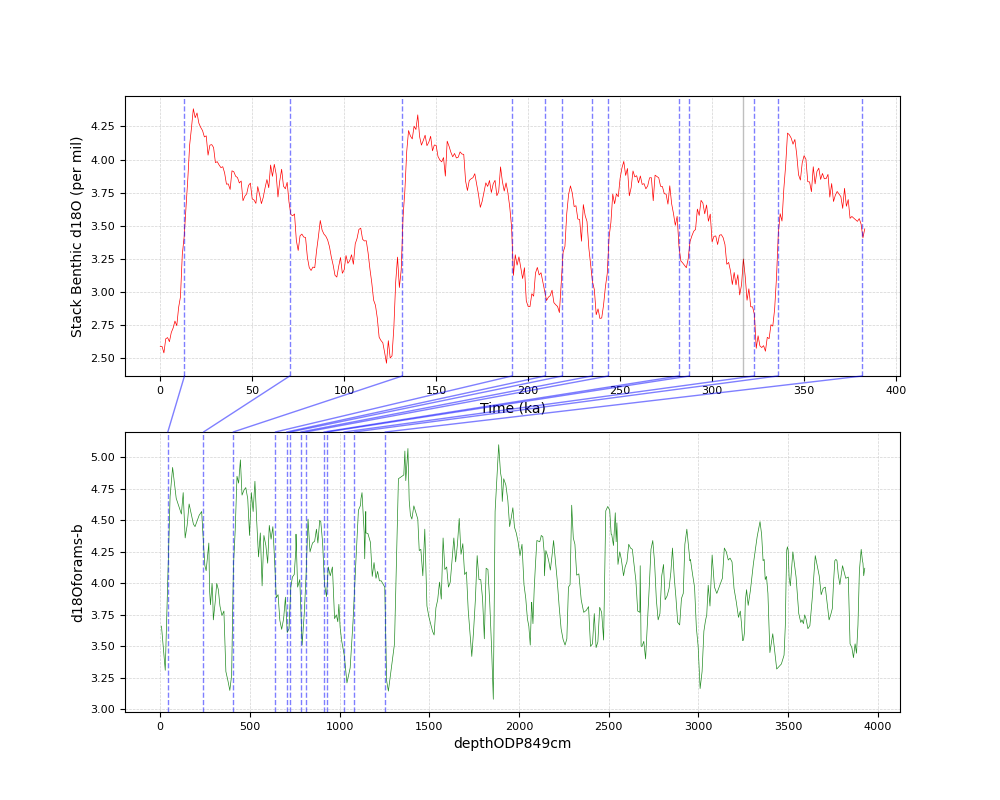
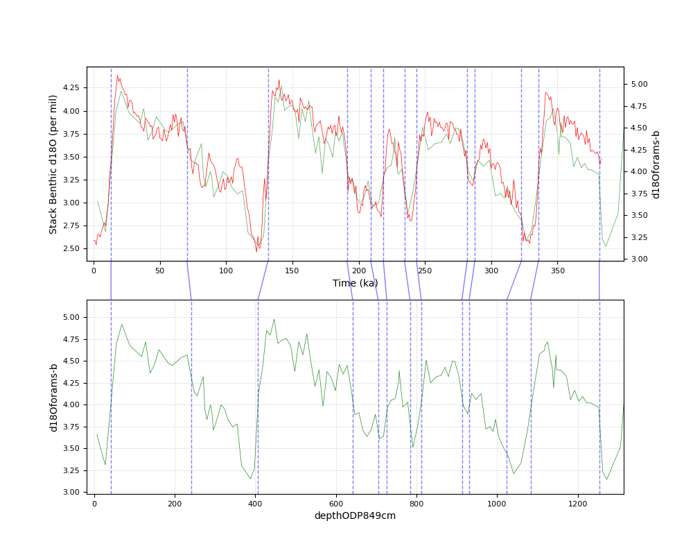

# PyAnalyseries

Python version for Analyseries

Select interactively match points on 2 curves to visualize the resulting interpolated curve. 

Based on:
 * matplotlib
 * scipy

## Usage

```python lineage.py testFile.csv 'Time (ka)' 'Stack Benthic d18O (per mil)' 'depthODP849cm' 'd18Oforams-b' pointers2.csv```

## Captures

  

  

  
